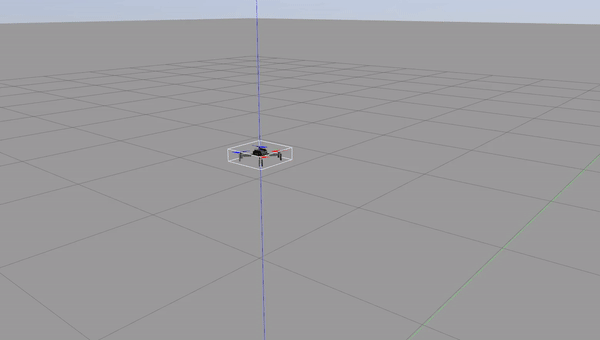

# RBE502_Final_Project

## Sliding Mode Control for Drone Trajectory Following



### Objective

The objective of this project is to develop a robust control scheme to enable a quadrotor to track desired trajectories in the presence of external disturbances.

---

## Part 1: Trajectory Generation

### Quintic Trajectory

Consider a quintic trajectory of the form \( q_d(t) = a_0 + a_1t + a_2t^2 + a_3t^3 + a_4t^4 + a_5t^5 \).

#### Coefficients

The coefficients \( a_0, a_1, a_2, a_3, a_4 \) and \( a_5 \) can be found by solving the matrix equation below:


#### Values

Here are the values for the unknowns:

- \( p_0 = (0, 0, 0) \) to \( p_1 = (0, 0, 1) \) in 5 seconds
- \( p_1 = (0, 0, 1) \) to \( p_2 = (1, 0, 1) \) in 15 seconds
- \( p_2 = (1, 0, 1) \) to \( p_3 = (1, 1, 1) \) in 15 seconds
- \( p_3 = (1, 1, 1) \) to \( p_4 = (0, 1, 1) \) in 15 seconds
- \( p_4 = (0, 1, 1) \) to \( p_5 = (0, 0, 1) \) in 15 seconds

#### Velocity and Acceleration

Differentiating \( q_d(t) \) with respect to time, we get:

- Velocity: \( q_d'(t) = a_1 + 2a_2t + 3a_3t^2 + 4a_4t^3 + 5a_5t^4 \)
- Acceleration: \( q_d''(t) = 2a_2 + 6a_3t + 12a_4t^2 + 20a_5t^3 \)

#### Desired Trajectory Plot


---

## Part 2: Controller Design

### Control Law

Control laws derived in handwritten notes are as follows:

#### Tuned Parameters

- **PD Controller**: \( K_p = 110 \), \( K_d = 8 \)
- **Lambda Parameters**: \( \lambda_z = 12 \), \( \lambda_{\phi} = 13 \), \( \lambda_{\theta} = 19 \), \( \lambda_{\psi} = 5 \)
- **Gain Parameters**: \( k_z = 6 \), \( k_{\phi} = 140 \), \( k_{\theta} = 111 \), \( k_{\psi} = 25 \)
- **Saturation Function Constant**: \( a = 1.3 \), \( a_{\phi} = 1 \), \( a_{\theta} = 1 \), \( a_{\psi} = 1 \)

---

## Part 3: Code Explanation

### Odom Callback and SMC Control

Upon receiving a call to `odom_callback`, the time (`self.t`) is initialized and relevant information such as the drone's current position, velocity, orientation, and angular velocity along the 3 axes are extracted from the odometry message. These values are then fed into the `smc_control` function.

#### SMC Control Function

`smc_control` function first invokes the `traj_evaluate` function which predicts the drone's trajectory and invokes the `generate_trajectory` to obtain the desired position, velocity, and acceleration for the x, y, z axis at that instant.

---

## Part 4: Trajectory 3D and Analysis

### 3D Trajectory


### Analysis

The 3D plot reveals that the drone's trajectory slightly deviates from the actual path, which can be attributed to the saturation function implemented to prevent chattering. Therefore, it can be concluded that the controller functions effectively and possesses the ability to handle external disturbances reasonably well, while still being able to closely track the desired trajectory.

---

## Getting Started

To get started with this project, clone the repository:

```bash
git clone https://github.com/Shivam7Sharma/RBE502_Final_Project.git
